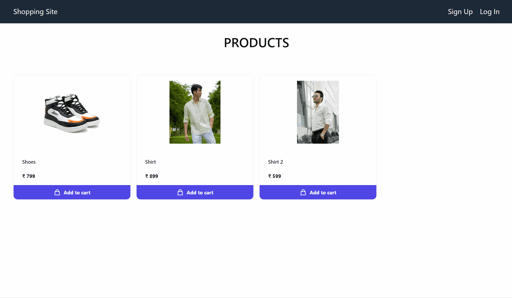

# Shopping Website

This is a simple e-commerce application that allows users to create an account, browse products, place orders, and receive email notifications after their orders are placed.

## Demo



## Setup

- Clone the repository.
- Install the dependencies by running npm install in both the client and server directories.
- Create a .env file in the server directory and add the environment variables that are in .env_example
- Create .env file in server with below variables

```
PORT=4000
MONGO_URI=YOUR_MONGO_URI
JWT_EXPIRY=24h
JWT_SECRET=secure&lOnGPasswoRd
```

- Start the server by running npm start in the server directory.
- Start the client by running npm start in the client directory.

> Admin account:

> Email: admin@admin.com

> Phone: 1234567890

> Password: admin
